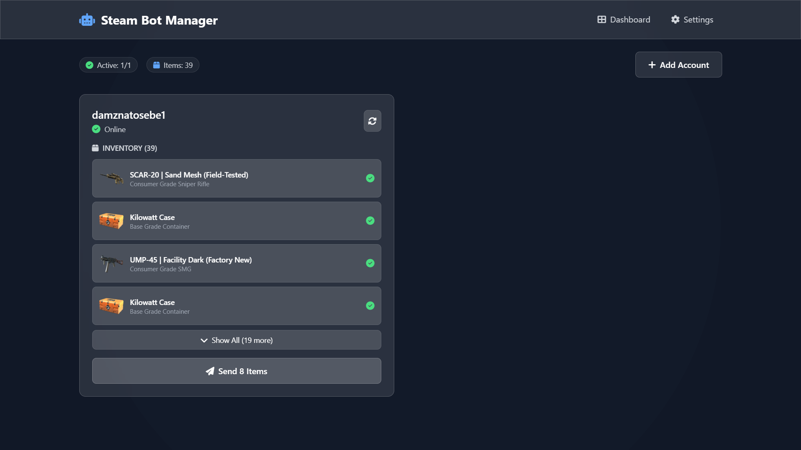
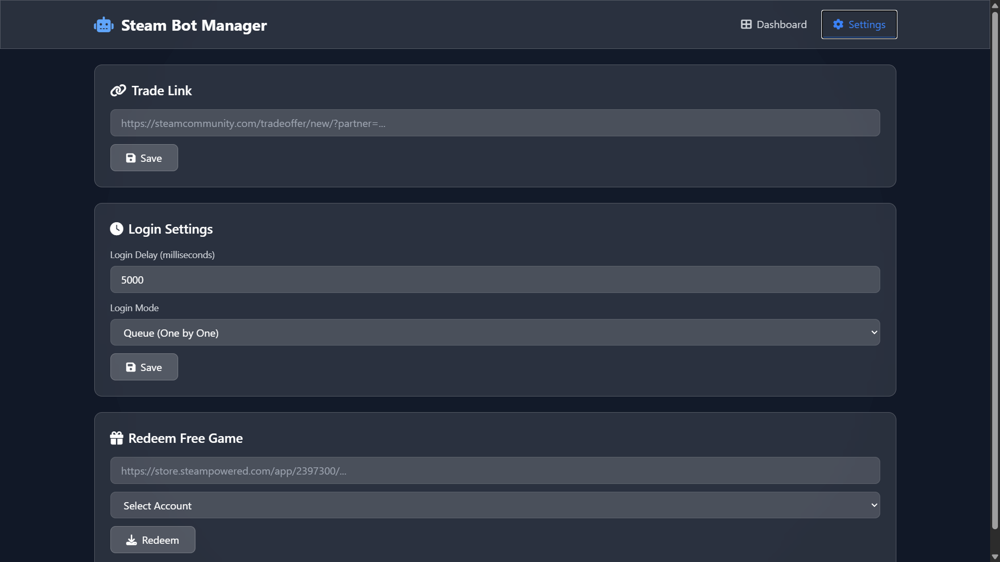

# Steam Bot Manager

A web-based Steam bot manager for CS2 inventory management, automated trading, and account management. Built with Node.js, Express, and real-time WebSocket communication.

### Dashboard

*Main dashboard showing account status, inventory, and trading controls*

### Settings

*Configuration panel for trade links, login settings, and game redemption*


### Prerequisites

- Node.js 20+ or Docker
- Steam accounts with 2FA enabled
- Steam API access

### Local Installation

```bash
# Clone the repository
git clone https://github.com/CVHNupsXD/SteamBOT.git
cd steambot

# Install dependencies
npm install

# Start the server
npm start
```

Access the dashboard at `http://localhost:3000`


## 🔧 Configuration

Edit `config.js` to customize:

```javascript
module.exports = {
  PORT: 3000,
  CS2_APP_ID: 730,
  CONTEXT_ID: 2,
  LOGIN_DELAY: 5000,
  INVENTORY_CACHE_TIME: 300000,
  MAX_LOGIN_RETRIES: 3,
  TRADE_POLL_INTERVAL: 30000
};
```

## Disclaimer

This tool is for educational purposes. Use at your own risk. The authors are not responsible for any consequences of using this software, including but not limited to Steam account bans or restrictions. Always comply with Steam's Terms of Service and Subscriber Agreement.

## Acknowledgments

- [node-steam-user](https://github.com/DoctorMcKay/node-steam-user)
- [node-steamcommunity](https://github.com/DoctorMcKay/node-steamcommunity)
- [node-steam-tradeoffer-manager](https://github.com/DoctorMcKay/node-steam-tradeoffer-manager)
- [steam-totp](https://github.com/DoctorMcKay/node-steam-totp)